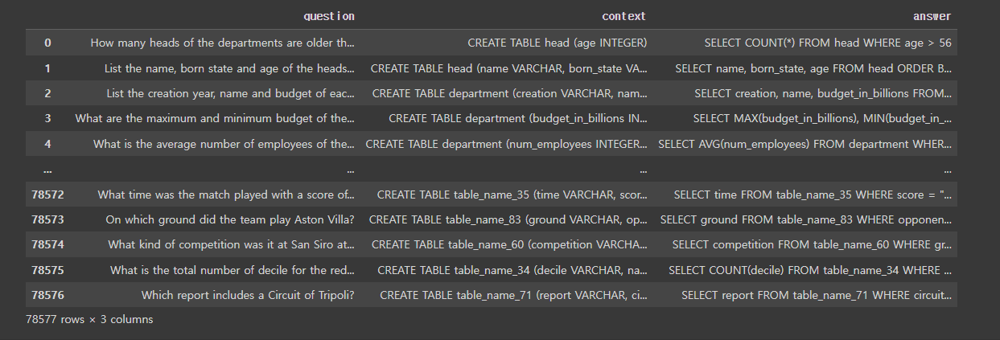

# sql-agent를 활용하여 자연어로 쿼리 생성

## 1. 작업 목적
슬랙에 쿼리를 입력하여 빅쿼리에서 데이터를 추출하는 슬랙봇을 제작하였지만 실무진이 쿼리가 익숙하지 않아 사용에 어려움이 있음  
자연어 입력만으로 쿼리 추출이나 값 추출하는 것이 목표  

## 2. 모델 사용 (LLM+RAG)
- LLM 생성(택 1)
  - openai api 샘플 쿼리 프롬프트 엔지니어링
  - open source 모델 gemma 파인 튜닝
- RAG 활용
   - 추가정보는 벡터DB에 저장하여 리트리버로 유사 쿼리를 검색 후 LLM이 참고하여 쿼리를 생성하는 모델 생성  
  
## 3. 기초 정보
### 테스트 테이블
- 네이버 검색량 조회 테이블  

|keyword|class|col|desktop|mobile|
|---|---|---|---|---|
|크로스핏|year_month|2022-01|100|1100|
|크로스핏|sex|남성|90|300|
|크로스핏|age|10대|80|400|

- langchain 툴킷 사용 : 리트리버를 서브툴킷으로 지정하여 벡터DB에 저장한 내용 추출  
  
> 컬럼명이 영문 약어로 되어있어 실제 자연어로 쿼리를 생성하기 위해  
> 모델이 각 매칭 값을 알 수 있도록 각 자연어와 영문 컬럼명의 매칭 값을 벡터DB에 저장하여  
> 리트리버로 입력값과 유사한 내용은 추출 후 llm으로 쿼리를 생성

## 4. gemma fine-tune
### 데이터셋
- b-mc2/sql-create-context [https://huggingface.co/datasets/b-mc2/sql-create-context]
  

  context에 테이블 생성 쿼리로 테이블 스키마를 판단하고 question에 입력값으로 answer의 쿼리를 생성하도록 학습  
  gemma 모델은 한글을 지원하기 때문에 question은 openai api로 한글로 전환 후 학습 진행  

- ai 허브 [https://www.aihub.or.kr/aihubdata/data/view.do?currMenu=&topMenu=&aihubDataSe=ty&dataSetSn=71351]

  양질의 데이터이나 LLM 파인튠을 위한 전처리가 많이 필요해보임 > 컬럼명과 자연어의 매칭이 안됨  
  한국어 데이터로 번역이 필요없다 

### 파인 튠
모델이 크기 때문에 bitsandbytes로 양자화 및 LoRA로 학습 웨이트를 줄여 학습 진행  
추론 결과에 sql query 외에도 질문 + 답변을 구어체로 출력하기 때문에 프롬프트 엔지니어링 + 파인 튜닝으로 최종 출력을 정리해야 함

  
## 5. 유의 사항
쿼리를 잘못 생성하여 원하지 않는 삭제나 수정 등이 발생할 수 있다  
유료 모델은 비용이 발생  

